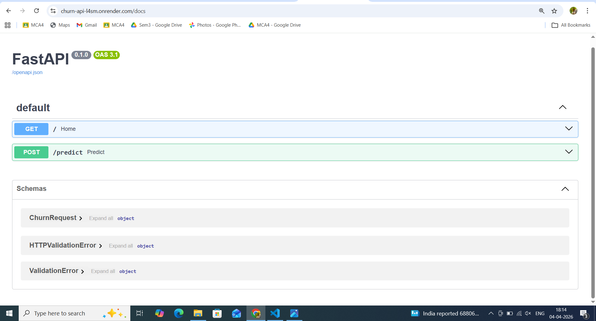
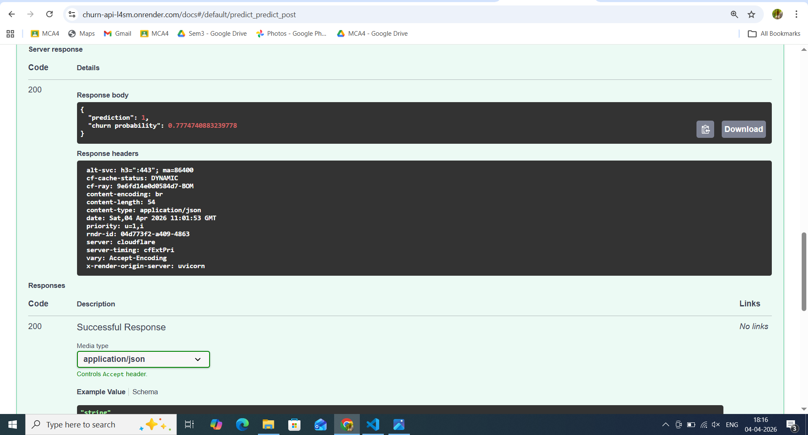

# Customer Churn Prediction using Machine Learning

## Project Overview
Customer churn is a major challenge for telecom companies. Retaining existing customers is significantly cheaper than acquiring new ones. This project aims to build a machine learning model that predicts whether a customer will churn based on demographic information, service usage, and billing details.

The goal is to identify high-risk customers so that businesses can take proactive retention actions.

---

## 🚀 Live API
The model is deployed as a REST API using FastAPI and is publicly accessible.

Base URL:
https://churn-api-l4sm.onrender.com

### API Endpoint

**POST /predict**

#### Example Request:
```json
{
  "gender": "Male",
  "SeniorCitizen": 0,
  "Partner": "Yes",
  "Dependents": "No",
  "tenure": 12,
  "PhoneService": "Yes",
  "MultipleLines": "No",
  "InternetService": "Fiber optic",
  "OnlineSecurity": "No",
  "OnlineBackup": "Yes",
  "DeviceProtection": "No",
  "TechSupport": "No",
  "StreamingTV": "Yes",
  "StreamingMovies": "No",
  "Contract": "Month-to-month",
  "PaperlessBilling": "Yes",
  "PaymentMethod": "Electronic check",
  "MonthlyCharges": 70.5,
  "TotalCharges": 850
}
```

#### Example Response:
``` json
{
    "prediction": 1,
    "churn_probability": 0.77
}
```

### API Documentaion

Interactive Swagger UI:
https://churn-api-l4sm.onrender.com/docs


## Dataset

Dataset: **"Telco Customer Churn Dataset"**

The dataset contains information about **7,043 telecom customers** with **21 features** including demographics, service subscriptions, and billing information.

### Key Features

|Feature      |Description    |
|-------------|-------------------------|
|tenure |Number of months the customer has stayed with the company |
| MonthlyCharges | Monthly service charges | 
| TotalCharges | Total amount charged to the customer | 
| Contract | Type of contract (Month-to-month, One year, Two year) | 
| InternetService | Internet service provider type | 
| PaymentMethod | Payment method used by the customer | 
| Churn | Target variable indicating whether the customer churned |

---

## Project Workflow

### 1.Data Cleaning

* Standardized categorical values (e.g., Yes/No formatting).
* Converted TotalCharges to numeric and handled missing values.
* Removed invalid or inconsistent records.

### 2. Exploratory Data Analysis (EDA) 

EDA was performed to understand customer behavior and churn patterns. 

Key analyses included: 

* Churn distribution 
* Contract type vs churn 
* Tenure distribution 
* Monthly charges vs churn 
* Correlation analysis

### 3.Feature Engineering and pipeline

A full preprocessing pipeline was built using:

* ColumnTransformer
* OneHotEncoder for categorical variables
* StandardScaler for numerical variables
* Handling missing values using SimpleImputer

This ensures that the model can handle raw input data directly during prediction.

### 4.Model Training

Handling class imbalance, Customer churn datasets are typically imbalanced.

Techniques used:
* Class weighting 
* SMOTE (Synthetic Minority Oversampling Technique)

Several models were trained and compared

* Logistic Regression(Class Balanced)
* Logistic Regression with SMOTE
* Random Forest
* Random Forest tuned
* XGBoost


### Model Evaluation

Models were evaluated using multiple metrics

* Accuracy
* Recall
* F1 score
* Precision
* ROC-AUC

## Model Deployment


The final model is deployed as a production-ready API using:

* FastAPI for serving predictions
* Uvicorn as ASGI server
* Render for cloud deployment

### Deployment Pipeline

Raw Input (JSON)
↓
FastAPI Endpoint
↓
Preprocessing Pipeline (Encoding + Scaling)
↓
Trained Model
↓
Prediction Output

This setup allows real-time predictions and integration with external systems.


Model performance

| Model  |Accuracy  |Recall  |F1 score  |Precision   | ROC-AUC  |
|--------|----------|--------|----------|------------|----------|
|Logistic Regression(Balanced)|~73%	| ~80%	| ~61%	| ~49%| 0.83 |
|Logistic Regression with SMOTE| ~73% | ~78%	| ~61%	|~50%| 0.83 |
| Random Forest| ~79%	| ~50%	| ~56%	| ~62% | 0.82 |
| Random Forest tuned| ~76%	| ~75%	| ~62%	| ~53%| 0.84 |
| XGBoost| ~76%	| ~54%	| ~54%	| ~55% |  0.80 |
| Final model| **~76%**	| **~75%**	| **~62%**	| **~53%** |  **0.84** |

The ROC-AUC score of **0.84** indicates strong capability in distinguishing churned customers from non-churned customers.

## Feature Importance 

The most influential factors affecting customer churn were:

1. Tenure
2. Total Charges
3. Contract Type
4. Monthly Charges
5. Internet Service Type

These features significantly impact churn prediction.

---

### Key Insights

* Customers with **Month-to-Month contracts** have the highest churn rate
* Customers with **low tenure** are more likely to churn
* **Higher monthly charges** increase churn probability
* **Fiber optics internet users** show relatively higher churn rate

---

### Business Recommendations

Based on the analysis

* Encourage customers to switch to **long-term contracts**.
* Focus retention strategies on **new customers with low tenure**. 
* Provide **discounts or loyalty programs** for customers with high monthly charges. 
* Improve service quality for **fiber optic customers**.

---

### Project Structure

```
telecom_churn_ml/ 
│ ├── data/ 
│     ├── raw/ 
│     └── processed/ 
│ ├── deployment/
│     ├── main.py
│     ├── requirements.txt
│     ├── schema.py
│ ├── models/
│     ├── churn_pipeline.pkl
│     ├── final_churn_model.pkl
│     ├── logistic_cw_pipeline.pkl
│     ├── logistic_smote_pipeline.pkl
│     ├── random_forest_tuned.pkl
│     ├── random_forest.pkl
│     └── xgboost.pkl 
│ ├── notebooks/ 
│     ├── 01_data_cleaning.ipynb 
│     ├── 02_eda.ipynb 
│     ├── 03_feature_engineering.ipynb 
│     ├── 04_model_training.ipynb 
│     └── 05_model_evaluation.ipynb 
│
│ ├── src/ 
│     ├── __init__.py
│     ├── train_pipeline.py
├── .gitignore 
├── procfile
├── README.md 
└── requirements.txt
```
    
---

## Technologies Used

* Python 
* Pandas 
* NumPy 
* Scikit-learn 
* Matplotlib 
* Seaborn 
* XGBoost 
* Imbalanced-learn

## Key Skills Demonstrated

* End-to-End Machine Learning Pipeline Development
* Data Cleaning and Feature Engineering
* Handling Class Imbalance(SMOTE, Class Weights)
* Model Evaluation and Hyperparameter Tuning
* Pipeline Building with scikit-learn
* API Development using FastAPI
* Cloud Deployment (Render)
* Production-ready ML System Design

## 📸 API PreviewS

### Swagger UI


### Prediction Output


## How to run the project

Clone the repository

git clone https://github.com/Sophia-Lazar/telecom_churn_ml

Install dependencies:

pip install -r requirements.txt

Run notebooks in order
1. Data Cleaning
2. EDA
3. Feature Engineering
4. Model Training
5. Model Evaluation

## Future Improvements

Possible enhancements include

* Add Streamlit frontend for user interaction
* Implement Docker containerization
* Deploy on AWS/GCP for scalability
* Add model monitoring and logging

---

## Author

```
Sophia Lazar
Machine Learning Enthusiast
```
---